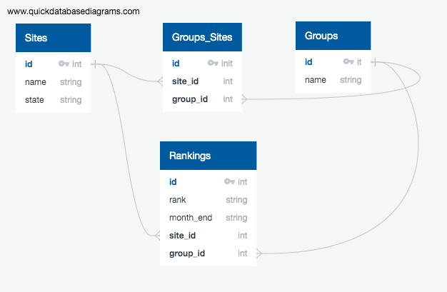

## Clean Node API
An illustrative node.js API attempting to apply clean principles to separate business logic with technologies.

Application Structure
```
============= INNER LAYER =====================================================================
validators                // validators of payloads
  L site                
    L index.js            // consistent API validator throws error when invalid and returns payload when valid
    L imperative.js       // hand-rolled validators not using library (for basic validation)
    L validate.js         // external library more advanced validation can switch out imperative 
  L group                 // follows site structure
  L ranking               // follows site structure
  L validatejs            // external library helpers shared across other validate.js files

models                    // create new entity by validating payload and returning new read only object 
  L site
    L index.js            // model to make site object. requires validation, normalises and returns object
    L index.spec.js       // tests makeSite()
  L group                 // follows site structure
  L ranking               // follows site structure

db                        // db connection and adapter
  L memory                // in memory JSON. used for seeding our tests and other DBs
    L sites.js            // see DB schema diagram         
    L groups.js           // see DB schema diagram
    L groups_sites.js     // see DB schema diagram
    L rankings.js         // see DB schema diagram
  L pg                    // TODO

============= MIDDLE LAYER =====================================================================
data-access               // think of it as our internal ORM (logic for our use-cases lies here)
  L sites-db           
    L index.js            // other controllers and drivers rely on this API (findSite, listSites, addSite)
    L index.spec.js       // test APIs. Important to have in order to safely switch out db
    L memory              // in memory
      L index.js          // expose the memory implementation
      L serializer.js     // serializes to DB specific properties
    L pg                  // TODO: Illustrative
  L groups-db             // follows site structure
  L rankings-db           // follows site structure

============= OUTER LAYER =====================================================================
drivers
  L webserver             // TODO: express web-server
    L routes
      L index.js          // TODO: routes paths
      L sites.js          // TODO: requires our data-access students-db
      L groups.js         // TODO: per above
      L rankings.js       // TODO: 
    L server.js           // TODO: 

```

DB Schema

